# AdvGAN

Paper: Generating Adversarial Examples with Adversarial Network.

This method can be applied for white-box attack.

## Overview

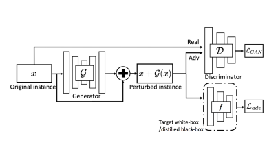

**Generator**: The generator trying to craft perturbations such that when added to the original image, it can fool the target-white box model.

**Discriminator**: The discriminator trying to distingush between perturbed examples and the clean samples.

Using LS-GAN framework for GAN training, also, adding some extra loss for stable, including: adversarial loss for fooling the network, and hinge loss to keep the perturbed samples close to the clean samples.

## How to use

I provide the pretrained model for targeted and untargeted attack in ``/saved_models`` directory. You can train it from scratch by modifying ``main.py``.

To test the model, run ``perturb.py``.

## Result

Untargeted attack:

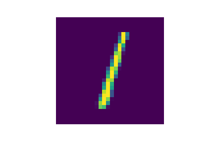 Clean image, with score = 1 for being class 1.
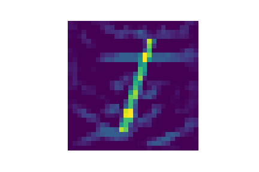 perturbed image, score nearly 0 for being class 1.

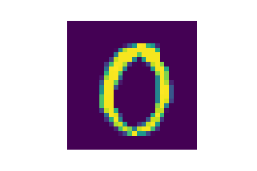 Clean image, with score = 1 for being class 0.
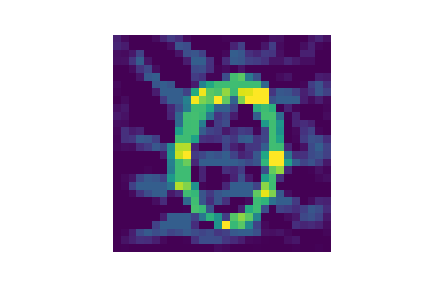 perturbed image, score = 0.0674 for being class 0.

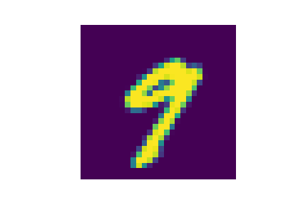 Clean image, with score =1 for being class 9.
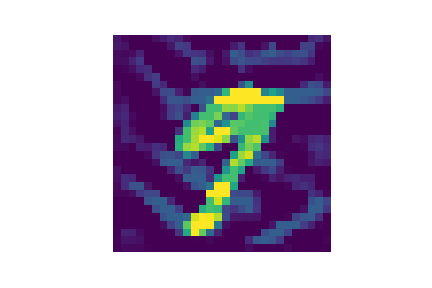 perturb image, width score nearly 0 for being class 9.

Targeted attack:

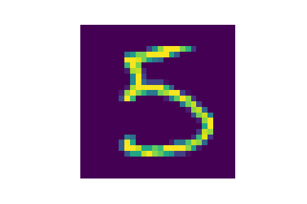 Clean image, with score = 1 for being class 1.
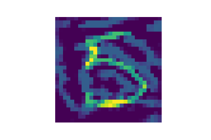 perturbed image, with score for class 0 is 99%.

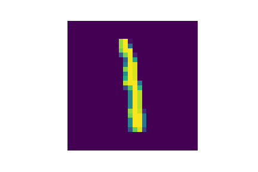 Clean image, with score = 1 for being class 1
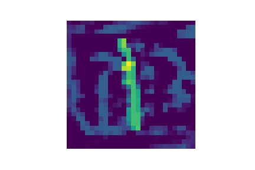 Perturbed image, with score nearly 1 for being class 0.

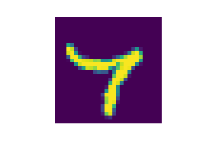 clean image, width score = 1 for being class 7
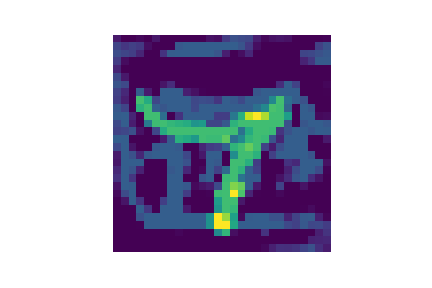 perturbed image, with score = 0.80 for being class 0.