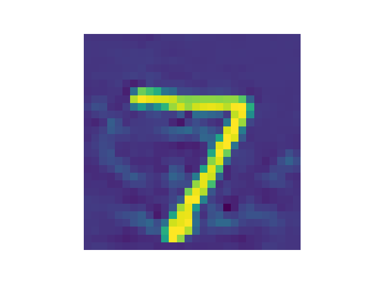
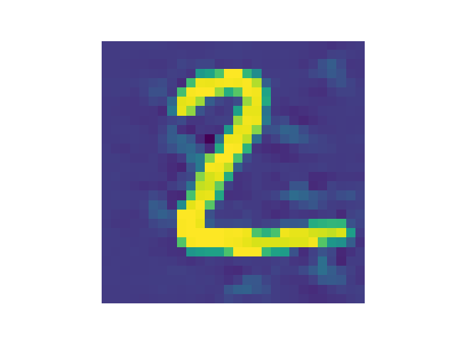
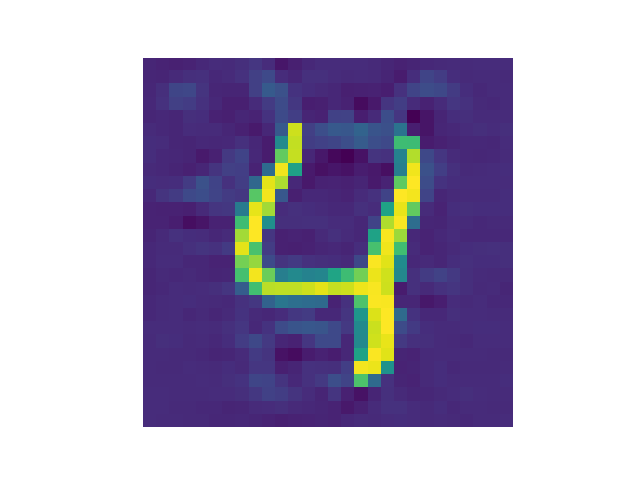
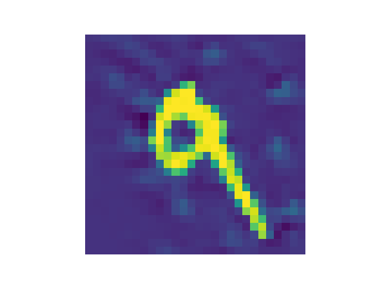

## Result

 Fool the network for targeted attack (31.52% for class 0 than 12.55% for class 7).

 Fool the network (29.78% for class 0 and 28.70% for class 2)

 Fool the network (26.94% for class 0 and 5.31% for class 4)

 Fool the network (24.11% for class 0 and 19.87% for class 9)