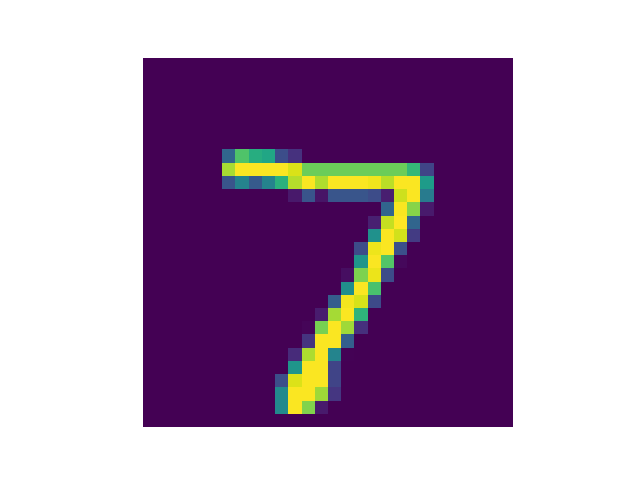

# DeepFool

Paper: DeepFool: a simple and accurate method to fool deep neural networks.

## Overview

DeepFool propose a method to fool the model by moving the data point to the decision boundary.

By using an iterative attack, and linearizing after the decision function locally around the current point, we can sucessfully fool the network.

## How to use

Choose the index of image that you like, and run the ``deepfool.py``.

## Result

Result of DeepFool:

 clean image with sucessfull categorized as 7.
 perturbed image, categorized as 9.

 clean image, sucessfully categoried as 2.
 perturb image, categorized as 1.

 clean image, categorized as 0.

 perturb image, categorized as 6.