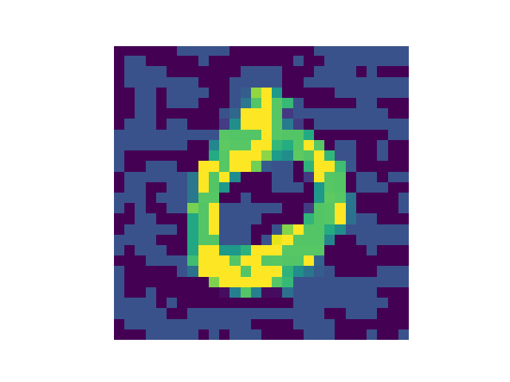
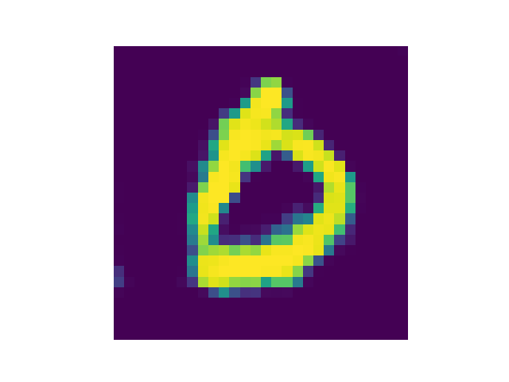
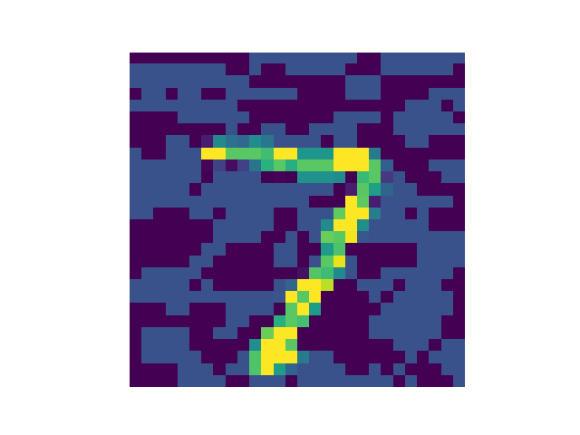

# Defense GAN

Paper: Protecting Classifiers against adversarial attack using Generative models

## Overview

The main idea of this paper is that for defense against an adversarial sample, we can remove noise by searching in the latent space. Concreatly, they propose training a GAN framework for generating samples, and the generator might reconstruct the clean data.

For a perturbed image feeded to our network, we can search for the latent variable that the reconstructed image of that latent is as close as possible to the input image. The author claims that the generated image is less noisy and similar to our original image, thus prevent the perturbed image from fooling the model.

## How to run

Modify the index of image in ``defense_gan.py`` to get your perturbed and refine image.

I provide pretrained WGAN-GP in ``NAA`` folder, you can refer this for training schememe.

## Result

All adversarial samples in this section is generated by FGSM method.

 Adversarial sample, categorized by class 6
 Refine sample (less noisy) accurately categorized as class 0

 Adversarial sample, categorized by class 9.
 Refine sample and accurately categorized by 7.