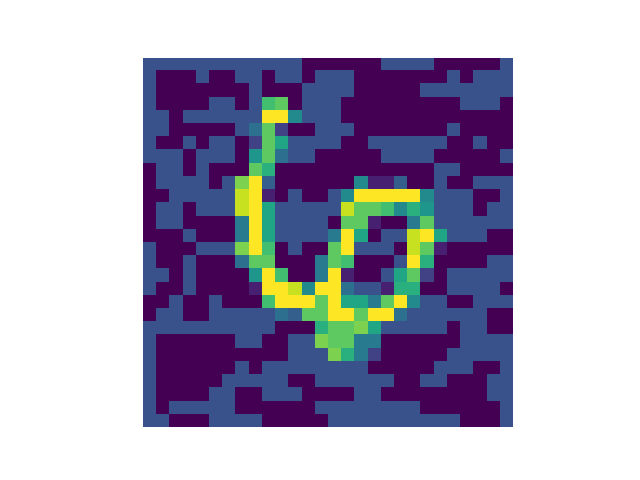

# Gradient and optimization method

## 1. Fast Gradient Sign Method (FGSM)

Paper: Explaining and harnessing adversarial examples (Ian GoodFellow, ICLR 2015)

### Result

 clean image 4.
 perturb image: 9.

 clean image
 perturb image: 4.

$$
f(x-\alpha f^{\prime}(x))=f(x)-\alpha f^{\prime}(x)^2+O(\alpha^2)
$$

if $\alpha$ is small enough, then $f(x-\alpha f^{\prime})<f(x)$

## 2. Box-constrained optimization LBFGS

Paper: Intriguing properties of neural network.

### Result

Although the box constrained method doesn't completely fool the classification model, it can still make the degrade of recognition quality for a single image.

 probability of class 9 is nearly 100%.

 probability of class 9 drops to 0.0809, and class 1 (targeted class) is 0.2738.

 probability of being 3 is nearly 1.

 probability of being 3 drops to 0.3415 and probability of being 1 becomes 0.1183. 