# Generating natural adversarial

Paper: **Generating natural adversarial examples** (ICLR 2018)

## Overview

Pipeline: This paper introduce a way to generate natural adversarial samples by crafting perturbation in the latent space.

Module:

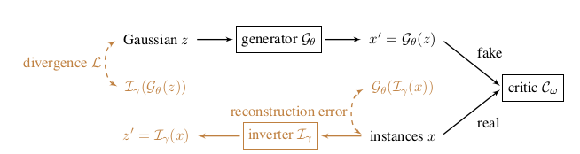

**GAN**: The generator learns the mapping from latent space to image space, and the discriminator tries to discriminate it. We use WGAN-GP to implement both the generator and discriminator.

**Invert Module**: this module learns the mapping from the image space to the latent space.

**Search algorithm**: To create perturbed samples, we need to search it in latent space and map it into image space. I provide 2 algorithms for implementing this.

## How to use

I provide both the pretrained **generator** and **invert** module in ``saved_models`` directory, as long as the pretrained module of LeNet (plays the role of black box model in this case). But you can train it from scratch by running ``train.py``.

To generate the perturbed samples, run ``perturb.py``. But it crashed when running locally in computer, so i advise using Colab,... to run it.

## Some interesting samples

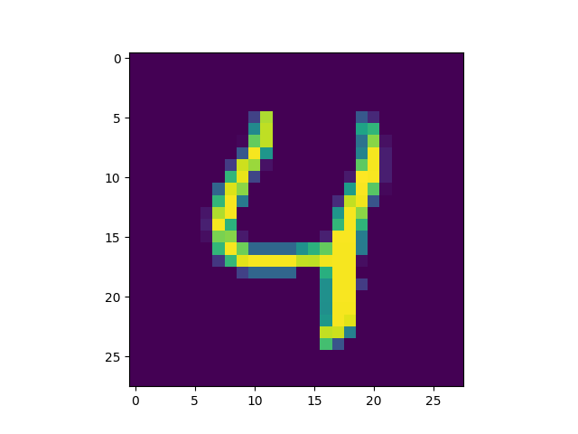 Clean image, label 4
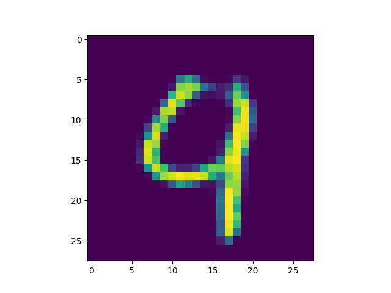 Perturbed image, label 9

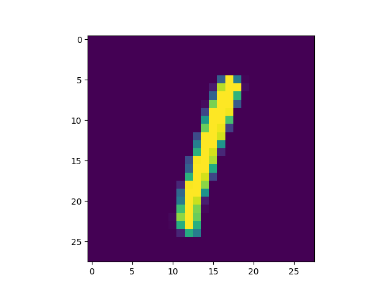 Clean image, label 1
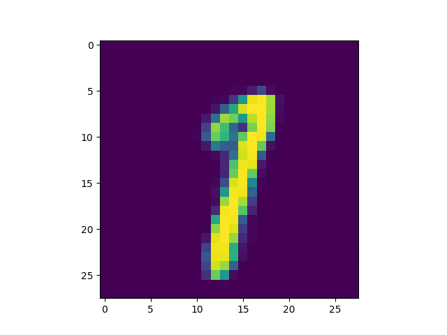 Perturbed image, label 7

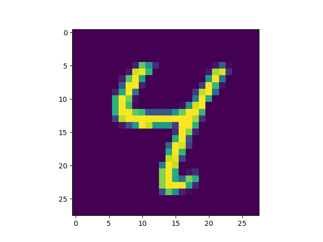 Clean image, label 4
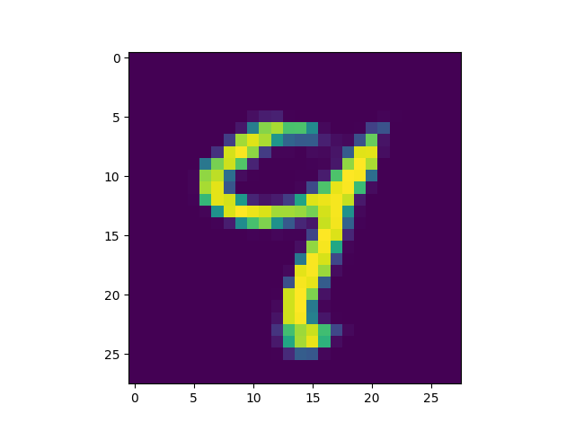 Perturbed image, label 9

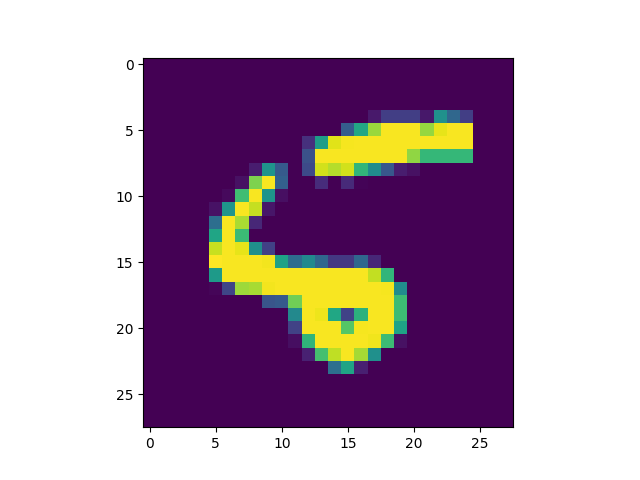 Clean image, label 5
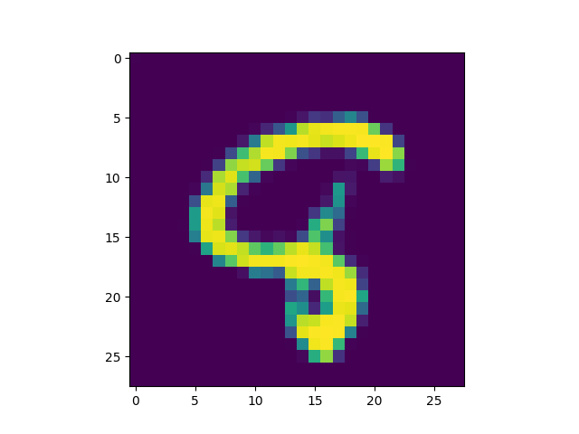 Perturbed image, label 8

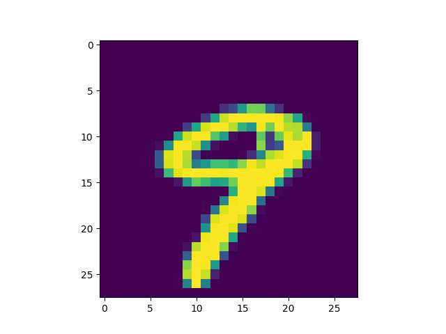 Clean image, label 9
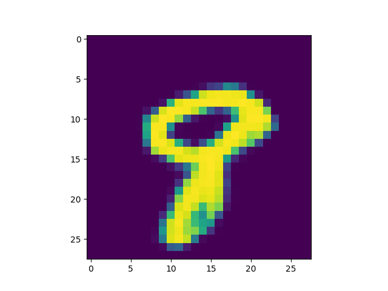 Perturbed image, label 8

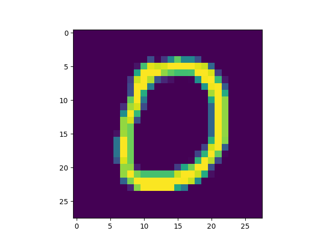 clean image, label 0
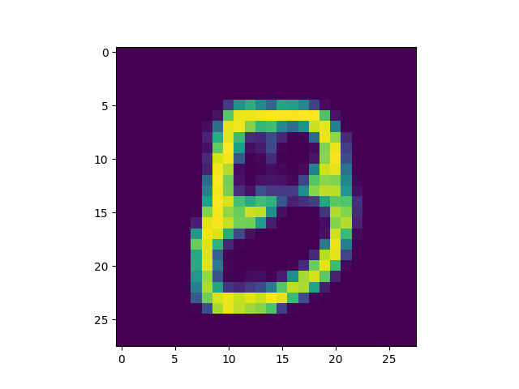 perturbed image, label 8