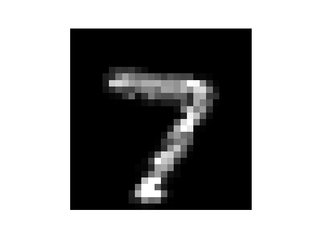
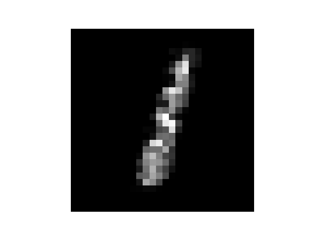
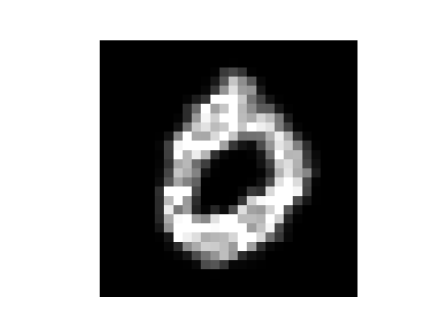
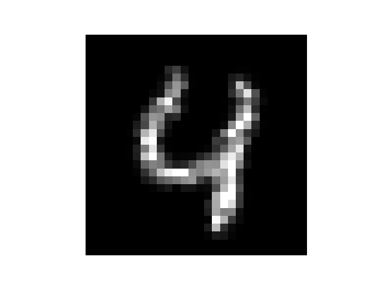

## Projected Gradient Descent (PGD) attack using Wasserstein distance

### 1. Motivation

The PGD Attack is an iterative and strong attack. When we apply the attack, we need to project it into an epsilon-ball around original point to keep the new image close to the original image.

The choice of ball is up to us. The original paper use L-infty norm. We can easily do it in a Lp norm. But how's about a different distance.

This repo reimplements the paper "Wasserstein Adversarial Examples via Projected Sinkhorn Iterations" by using Wasserstein distance. In this paper, we care about how to project a point into epsilon-ball around x0 by using Wasserstein distance.

### 2. Work

This reimplementation is based on the original implementation (the Lambert function,...)

### 3. Results

Perturbed sample, recognized by 9.

Perturbed sample, recognized by 8.

Perturbed sample, recognized by 6.

Perturbed sample, recognized by 9.

The result here is quite good, most images are attacked in its content.